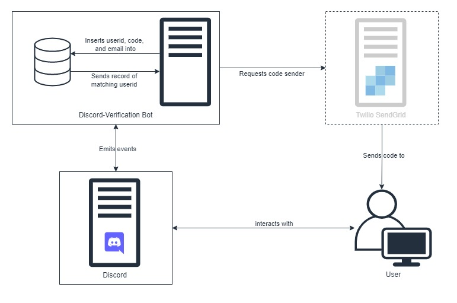

<a href="https://www.npmjs.com/@hunteroi/discord-verification"></a>
<a href="https://www.npmjs.com/@hunteroi/discord-verification"></a>

# discord-verification

A framework to integrate a verification system with your Discord guild built with DiscordJS.

- Integrates SendGrid by default
- Emits events like `codeCreate`, `userCreate`, `senderCall` and **3 more**!
- And much more!


See [./example/index.js](example/index.js).

## Installation

```sh
npm install --save @hunteroi/discord-verification
```

## Prerequisites ⚠️

You must use **NodeJS v16.6.0 or higher** to run a bot with this library.

You also must not forget to include [mandatory intents](#mandatory-intents) and [partials](#partials) as well as give your bot the rights to read messages and commands.

### Mandatory intents

- GUILDS: used to access guild content such as channels.

In case you are willing to use guild messages, you will need this intent:

- GUILD_MESSAGES: used to read guild messages.

In case you are willing to use direct messages, you will need these intents:

- DIRECT_MESSAGES: used to read direct messages.

### Partials

- MESSAGE: used to complete direct messages when received from the API.

## Default Services

This library integrates an email sender using [Twilio SendGrid](https://www.twilio.com/sendgrid/email-api). You can obviously integrate your own system that communicates a code to the user (eg: an SMS sender, an authentication application or whatever suits your case the best).
This is the same system for the storing system : by default, it uses a local JSON file as a database but you can obviously use your own system.

You are responsible of the way the services (should) act and what they receive, which means you are also responsible of the background checks on the input data.

<div align="center">



</div>

There are two built-in services that you can use with the `VerificationManager`:

- `SendGridService` : to send an email using Twilio SendGrid
- `JSONDatabaseService` : to store data in a JSON file

In order to use them, you can instanciate them and give them as parameters to the `VerificationManager` constructor.

### SendGrid

In case you are willing to use the default SendGrid service, you need to comply to certain requirements:

- you need an account and API key on [Twilio SendGrid](https://sendgrid.com/free?source=sendgrid-nodejs)
- the service's options must include the following keys:
  ```js
  {
   apiKey: '',
   mailData: {
    from: ''
   }
  }
  ```
  If you want to use a dynamic template, you should use `code` and `name` as variables defined in your SendGrid template.

For more information, please look at `@sendgrid/mail` documentation and check out their website.

### JSON file database

In case you are willing to a JSON file as database, you need to comply to certain requirements:

- you need to create a `db.json` file (rename `db.json.copy`)
- your stored model must implement the [`IUser`](/src/types/IUser.ts) interface.

### Writing your own services

If you are willing to use your own services, you need to know a few things. First things first, the services should implement the right interface:

- the "sender" service should implement [`ISenderAPI`](/src/types/SenderAPI.ts).
- the "database" service should implement [`IStoringSystem<T extends IUser>`](/src/types/StoringSystem.ts).

If you need examples, take a look at [`SendGridService`](/src/services/SendGridService.ts) and [`JSONDatabaseService`](/src/services/JSONDatabaseService.ts).

## Events

```ts
manager.on(VerificationManagerEvents.codeCreate, (code) => {});
manager.on(
  VerificationManagerEvents.codeVerify,
  (user, userid, code, isVerified) => {}
);
manager.on(VerificationManagerEvents.userCreate, (user) => {});
manager.on(VerificationManagerEvents.userAwait, (user) => {});
manager.on(VerificationManager.senderCall, () => {});
manager.on(VerificationManagerEvents.storingSystemCall, () => {});
```

## Contribution

Contributions are what make the open source community such an amazing place to be learn, inspire, and create. Any contributions you make are greatly appreciated.

1. Fork the Project
2. Create your Branch: `git checkout -b patch/YourAmazingWork`
3. Commit your Changes: `git commit -m 'Add some amazing work'`
4. Push to the Branch: `git push origin patch/YourAmazingWork`
5. Open a Pull Request
